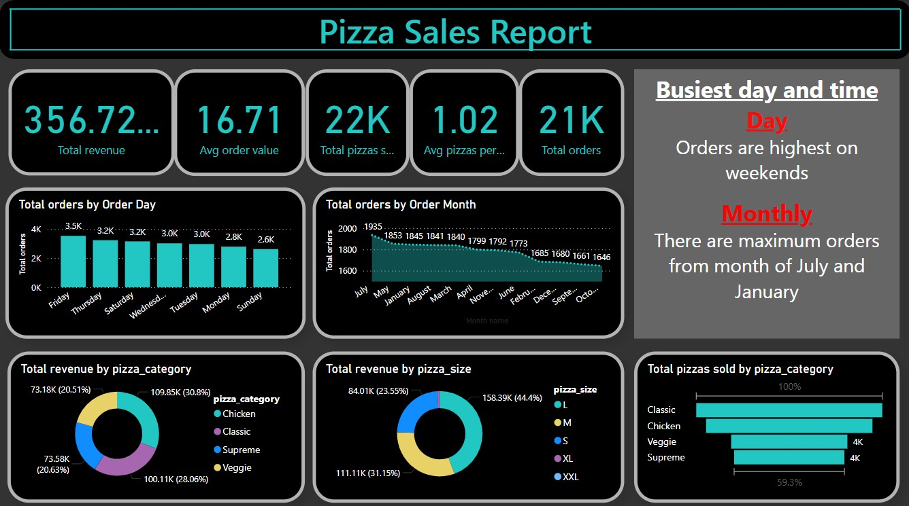

# 🍕 Pizza Sales Dashboard (Power BI)

This project is a **Pizza Sales Report Dashboard** built using **Power BI**, designed to provide deep insights into pizza sales performance based on order trends, revenue, and product popularity. 

---

## 📊 Key Insights

- **Total Revenue**: $356.72K  
- **Total Orders**: 21K+  
- **Total Pizzas Sold**: 22K  
- **Average Order Value**: $16.71  
- **Average Pizzas per Order**: 1.02  

### 🔥 Busiest Periods:
- **Day-wise**: Highest orders on **weekends**, especially **Friday**
- **Monthly**: Peak orders in **July** and **January**

### 💰 Revenue Breakdown:
- **By Pizza Category**:
  - Classic: 30.8%
  - Supreme: 28.06%
  - Veggie: 20.63%
  - Chicken: 20.51%
- **By Pizza Size**:
  - L: 44.4%
  - XL: 31.5%
  - M: 23.5%

### 🥇 Best-selling Pizza Category:
- **Classic Pizzas** are the most sold, followed by Chicken and Veggie

---

## 📌 Tools & Technologies

- **Power BI** (for data visualization)
- **DAX** (for calculated fields and KPIs)
- **Power Query** (for data transformation)
- **CSV Dataset** (simulated pizza sales data)

---

